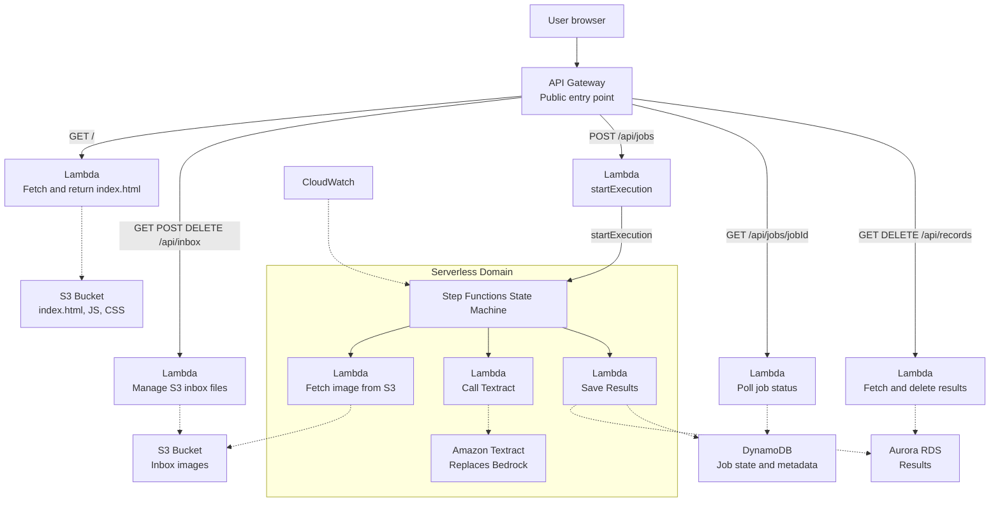

```mermaid
graph TD
    User[User browser] --> APIG[API Gateway\nPublic entry point]

    APIG -->|GET /| L0[Lambda\nFetch and return index.html]

    APIG -->|GET POST DELETE /api/inbox| LInbox[Lambda\nManage S3 inbox files]
    
    APIG -->|POST /api/jobs| LSubmit[Lambda\nstartExecution]
    APIG -->|GET /api/jobs/jobId| LPoll[Lambda\nPoll job status]

    APIG -->|GET DELETE /api/records| LRecords[Lambda\nFetch and delete results]
    
    L0 -.-> S3Web[S3 Bucket\nindex.html, JS, CSS]

    LInbox -.-> S3Store[S3 Bucket\nInbox images]
    LSubmit -->|startExecution| SF
    LPoll -.-> DDB[DynamoDB\nJob state and metadata]
    LRecords -.-> Aurora[Aurora RDS\nResults]

    subgraph Serverless[Serverless Domain]
        SF[Step Functions State Machine]
    
        SF --> L1[Lambda\nFetch image from S3]
        SF --> L2[Lambda\nCall Textract]
        SF --> L3[Lambda\nSave Results]

        L2 -.-> Textract[Amazon Textract\nReplaces Bedrock]
    end 
    L1 -.-> S3Store
    L3 -.-> Aurora
    L3 -.-> DDB

    CW[CloudWatch] -.-> SF
```
# mermaid code 2